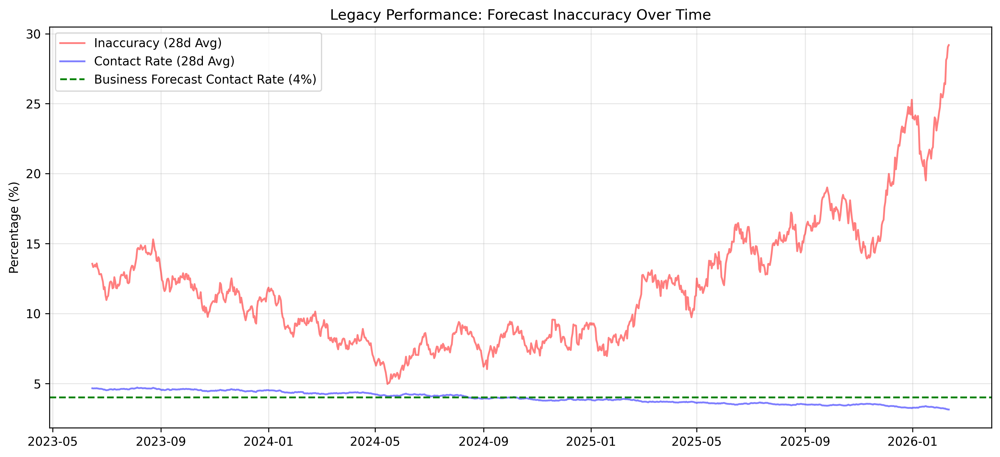
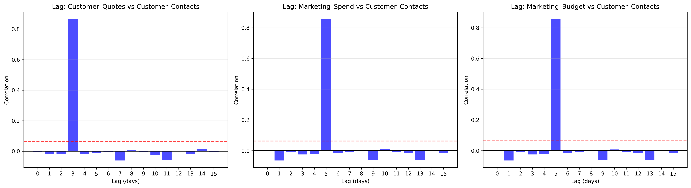
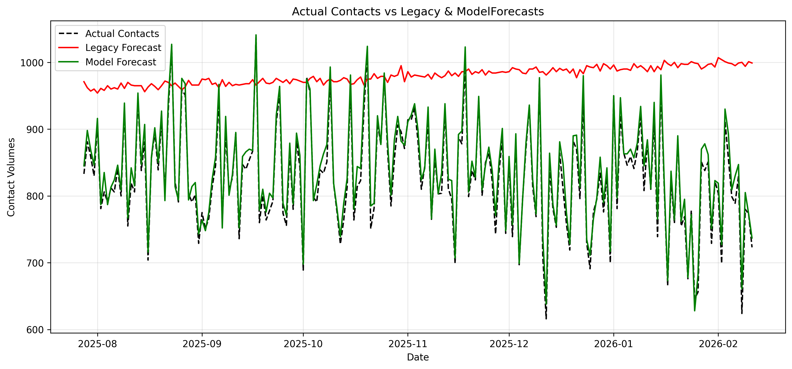

# Demand Forecasting Optimization: ML Business Case
### *Transitioning from Static Logic to Predictive Modeling*

---

## 📌 Project Overview
The goal of this project is to identify and resolve a critical resource allocation issue where legacy forecasting methods failed to accurately predict customer demand.

## 🎯 The STAR Breakdown

### **Situation**
The business are seeing the variance between forecasted and actual customer contacts increase. This is leading to insufficient staffing, either over-staffing and wasting resources or under staffing and leading to poor customer experience.

Early investigation completed already by the business suggest that the legacy forecast model was showing improvement but now the inaccuracy is worse than it has ever been.

### **Task**
We have agreed the following three objectives with the business;
* **Validate:** Confirm that the legacy forecasting model is no longer fit for purpose<br><br>
* **Discover:** Analyse the data provided by the business to discover the true drivers for customer demand<br><br>
* **Build:** Once drivers have been discovered look to build a new forecasting model leveraging machine learning<br><br>

### **Action**
* **Modular Architecture:** Developed a professional-grade Python pipeline split into `utils/` and `src/`.
* **Validation:** Using the sample data generated, confirmed that the legacy forecasting method was not only ineffective but had been getting worse over time;

<small>*Figure 1: Objective 1 - Visual proof that the 4% contact rate was failing over time*</small><br><br>
* **Discover:** Once it was confirmed that existing model was failing and finding no same-day correlations for customer contacts I looked at leading drivers. Looking for these lagged correlations showed 3 features of our data showing high coefficients for contacts;

<small>*Figures 2: Objective 2 - Discovering the Contact Drivers*</small><br><br>
* **Build:** Given two of our drivers were so similar I dropped 'Marketing_Spend' to avoid multicollinearity in my model (essentially 'Dimensionality Reduction'). Using Marketing_Budget and Customer_Quotes as features my new model shows a sharp increase in forecast accuracy;

<small>*Figure 3: Actual Contacts vs Business and Model Forecasts*</small>

### **Result**
As shown above in Figure 3, the new model created by leveraging the power of machine learning has a significant accuracy improvement on the old business model being used. Historically, even when the business saw improvements in accuracy, MAPE (mean absolute percentage error) rate was ~7%. With a clearer understanding of true contact drivers the ML Forecast built here has a MAPE of ~1%.<br><br>
With this improved accuracy, deeper understanding of contact drivers and validation that the legacy forecasting model is ineffective I have been able to tick off all asks from the business in this use case.

---
## 📂 Repository Structure
<pre>
demand_forecasting_ML/
├── main.py                 # Master script
├── src/                    # Project-specific logic
│   └── stages.py           # Objective 1, 2, and 3 logic
├── utils/                  # Reusable utility functions
│   └── demand_forecasting_functions.py
├── data/                   # Generated synthetic datasets
├── visuals/                # Exported charts for analysis/README
└── requirements.txt        # Project dependencies
</pre>

## 🛠️ How to Run
1. **Clone the repository:**
   ```bash
   git clone [https://github.com/b-cassidy/portfolio/demand_forecasting_ML.git](https://github.com/b-cassidy/portfolio/demand_forecasting_ML.git)

2. **Install dependencies:**
    ```bash
    pip install -r requirements.txt
</pre>

3. **Execute Pipeline:**
    ```bash
    python main.py
</pre>
