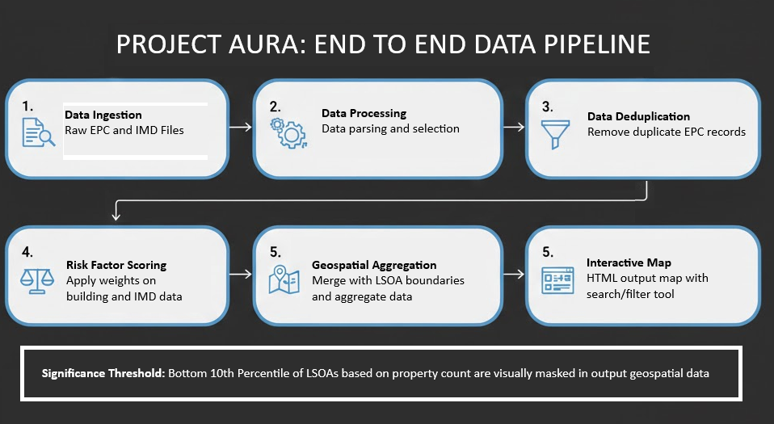
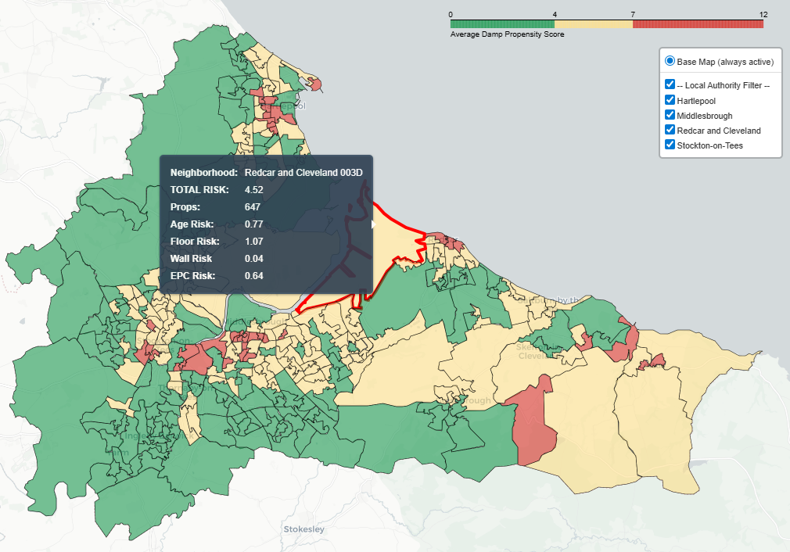

# Project Aura: Predictive Public Health & Housing Risk
### *Mapping the Intersection of Building Fabric and Fuel Poverty in the North East*

---

## 📌 Project Overview
Project Aura is a geospatial intelligence platform built on the back of the rising public health crisis surrounding damp and mould in UK houses. In October 2025 [Awaab's Law](https://www.gov.uk/government/publications/awaabs-law-guidance-for-social-landlords/awaabs-law-guidance-for-social-landlords-timeframes-for-repairs-in-the-social-rented-sector#introduction) came into effect which means landlords now need to investigate hazards (including damp and mould) within 10 days of them being reported by tenants. This project is designed to help identify which areas of the North East *may* see a higher propensity for damp and mould to develop.

Project Aura achieves this by synthesising Energy Performance Certificate (EPC) data with localised Indices of Multiple Deprivation (IMD) to create a 'Risk Score' built on building age, fabric and socio-economic factors. This risk score is then visualised for easier interpretation, potentially allowing social landlords to move from a reactive to a proactive maintenance schedule or property maintenance companies to know which areas of the North East they could canvas for work.

## 🎯 The STAR Breakdown

### **Situation**
'Ben's Builders' an established property maintenance company specialising in damp and mould preventative work want to better focus their advertising spend in areas of the North East where their work is potentially in higher demand.

Early reading and research has shown that damp and mould can generally be more prevalent in homes with lower energy ratings and compounded by reduced heating on the back of rising costs and fuel poverty.

### **Task**
We have agreed to use the open source EPC and IMD data that is available to create an overall risk score on every property in a set area that we want to look at and visualise the results to show the 'Hot Spots' for mould and damp propensity.

### **Action**
* **Modular Architecture:** Developed a professional-grade Python pipeline spilt into 'utils/' and 'src/' that can be expanded as needed <br><br>
* **Ingested EPC & IMD Data:** Pipeline created to download and process open source data, pipeline setup to react to the data being ingested so this can be re-used for any area of the country if needed

<small>Figure 1: High level data pipeline created for Project Aura</small><br><br>
* **Risk Score Created and Applied:** Total risk score on a per property basis has been built up taking building age, construction material, details on insulation, EPC ratings and an areas deprivation ranking (to infer potential fuel poverty). Customer scoring functions built and saved in 'utils/' with banding/ranking of scores easily tweaked if needed in 'src/' files<br><br>
* **Data visualised using geospatial intelligence:** Once scoring has been applied and validated, figures were aggregated at a Lower Layer Super Output Area ([LSOA](https://www.ons.gov.uk/methodology/geography/ukgeographies/statisticalgeographies)) with a RAG (red, amber green) colour grading applied to highlight the areas with the highest possible propensity for damp and mould issues

<small>Figure 2: Sample output mapping from project showing slicers and tooltip</small><br>

### **Result**
The Project Aura sample use case would help 'Ben's Builders' to identify the areas they should look at spending more of their advertising budget on. 

This kind of data-driven targeting could not only help see an increase in income but a reduction in marketing spend. With the pipeline being built here being modular, this could easily be updated to look at a different area of the country or to tweak our risk scoring if needed without too much additional work needed. Further helped by the output here being a standalone HTML dashboard that requires no additional software or licensing to be used.


## 🚀 Future Enhancements

While the current iteration of Project Aura gives us a robust baseline for risk identification, the following additions would further refine either the accuracy of the output or it's commercial utility:

* **Real-Time Weather Integration:**  Incorporating live humidity and temperature data via API to create a "Live Risk" overlay, helps identify in real-time when external factors might further increase the potential for mould growth

* **Machine Learning (ML) Predictive Modeling:** Training a  model using historical housing disrepair claims to further enhance our risk scoring.

* **Automated CRM Lead Generation:** Developing a script to automatically export high-risk addresses identified here into a CRM format, allowing marketing teams to trigger automated outreach campaigns as soon as new EPC data is ingested.

---
## 📂 Repository Structure
<pre>
project_aura_GIS/
├── data/
│   ├── raw/                      # Original EPC and IMD CSV/GeoJSON files
│   └── processed/                # Deduplicated data and final mapping output
├── src/
│   ├── step_01_ingestion.py      # Logic for downloading/loading raw datasets
│   ├── step_02_processing.py     # Deduplication and synthetic key logic
│   └── step_03_mapping.py        # Folium aggregation and dashboard generation
├── utils/
│   └── project_aura_functions.py # Custom functions for project
├── visuals/
│   ├── pipeline.png              # Workflow diagram
│   └── mapping.png               # Dashboard sample output
├── requirements.txt              # Project dependencies
└── README.md
</pre>


## 🛠️ How to Run
1. **Clone the repository:**
<br>Clone the repository
   ```bash
   git clone https://github.com/b-cassidy/project_aura_GIS.git
</pre>

2. **Install dependencies:**
<br>Install the required geospatial and data science libraries
    ```bash
    pip install -r requirements.txt
</pre>

3. **Download needed data files:**
<br>Due to the size of the raw input files copies of these are not being stored in git. You will need to source these files yourself.
    * **EPC Data:** Download 'Domestic EPC' certificates for your chosen areas from [Department for Levelling Up, Housing & Communities](https://epc.opendatacommunities.org/domestic/search) open data site.
    * **IMD Data:** Download 'File 1: index of multiple deprivation" at the LSOA level from [GOV.UK](https://www.gov.uk/government/statistics/english-indices-of-deprivation-2019)
    * **Postcode Lookup:** Download the National Statistics Postcode Lookup file from the [ONS Portal](https://geoportal.statistics.gov.uk/) (free account needed)
    * **Geospatial Boundaries:** Download the LSOA (Dec 2021) Boundaries Full Clipped EW BFC GeoJSON folder from the [ONS Portal](https://geoportal.statistics.gov.uk/) (free account needed)


4. **Execute Pipeline:**
<br>The pipeline is designed to be executed as a single workflow. Running main.py will trigger the end-to-end process: Ingestion → Deduplication → Scoring → Aggregation → Mapping.
    ```bash
    python main.py
</pre>

5. **Output:**
<br>Once the script completes, the final interactive dashboard will be saved to the processed data directory:
    * **File:** data/processed/project_aura_map.html
    * **Viewing:** File can be opened in any modern web browser
